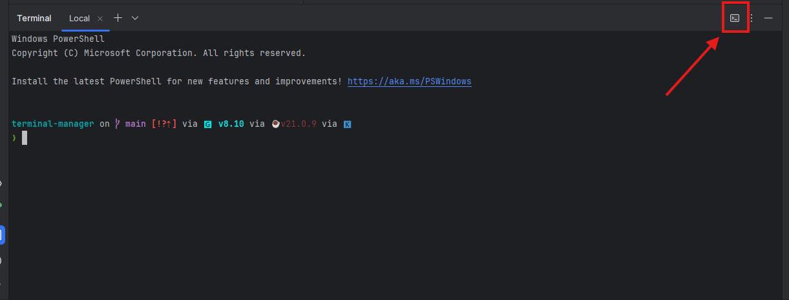
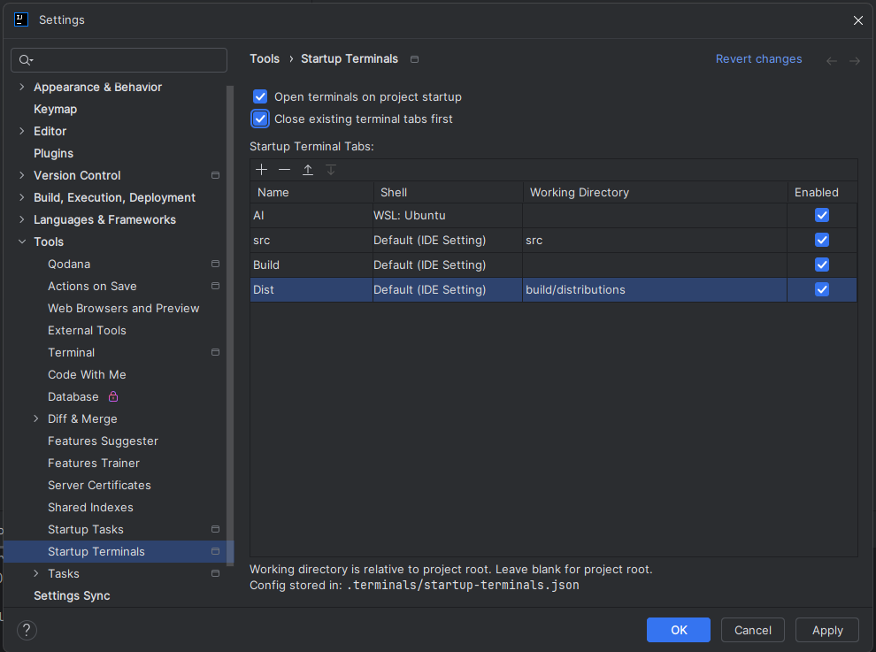
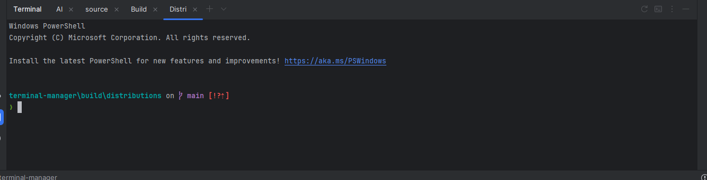

# Terminal Manager

An IntelliJ plugin that automatically opens pre-configured terminal tabs when you open a project.

I created this plugin out of frustration when working with a monorepo where I needed multiple tools running in different terminal windows. Feature requests are welcome - feel free to open an issue on GitHub or raise a PR. 

## Features

- Automatically open multiple terminal tabs on project startup
- Configure different shells per tab (PowerShell, WSL/Ubuntu, CMD, Git Bash, etc.)
- Set custom working directories relative to project root
- Name your terminal tabs for easy identification
- Enable/disable individual tabs without deleting them
- Optionally close existing terminal tabs before opening new ones
- Reset terminals with one click to restore your configured setup
- Per-project configuration stored in `.terminals/startup-terminals.json`

## Installation

Install from the JetBrains Marketplace:
1. Open **Settings** > **Plugins** > **Marketplace**
2. Search for "Terminal Manager"
3. Click **Install**

## Usage

### Toolbar Buttons

The plugin adds two buttons to the terminal toolbar:



| Button | Icon | Description |
|--------|------|-------------|
| **Reset Terminals** | Restart icon | Close all terminals and reopen configured startup terminals |
| **Settings** | Console icon | Open the Startup Terminals settings |

You can also access settings via **Settings** > **Tools** > **Startup Terminals**

### Configuring Terminal Tabs



| Option | Description |
|--------|-------------|
| **Open terminals on project startup** | Enable/disable automatic terminal opening |
| **Close existing terminal tabs first** | Clear existing tabs before opening configured ones |

### Tab Configuration

| Column | Description |
|--------|-------------|
| **Name** | Display name for the terminal tab |
| **Shell** | Shell type (Default, PowerShell, WSL, CMD, Git Bash, etc.) |
| **Working Directory** | Path relative to project root (leave blank for project root) |
| **Enabled** | Toggle individual tabs on/off |

Use the **+** / **-** buttons to add or remove tabs, and the arrow buttons to reorder them.

### Result

Once configured, your terminal tabs will automatically open when you open the project:



### Reset Terminals

Click the reset button to close all current terminal tabs and reopen your configured startup terminals. A confirmation dialog will appear the first time - check "Don't ask again" to skip this dialog in the future.

## Configuration File

Settings are stored per-project in `.terminals/startup-terminals.json`. You can commit this file to share terminal configurations with your team.

Example configuration:
```json
{
  "enabled": true,
  "closeExistingTerminals": true,
  "skipResetConfirmation": false,
  "tabs": [
    {
      "name": "AI",
      "shellId": "wsl-ubuntu",
      "workingDirectory": "",
      "enabled": true
    },
    {
      "name": "Build",
      "shellId": "default",
      "workingDirectory": "",
      "enabled": true
    }
  ]
}
```
