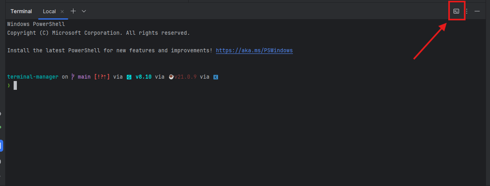
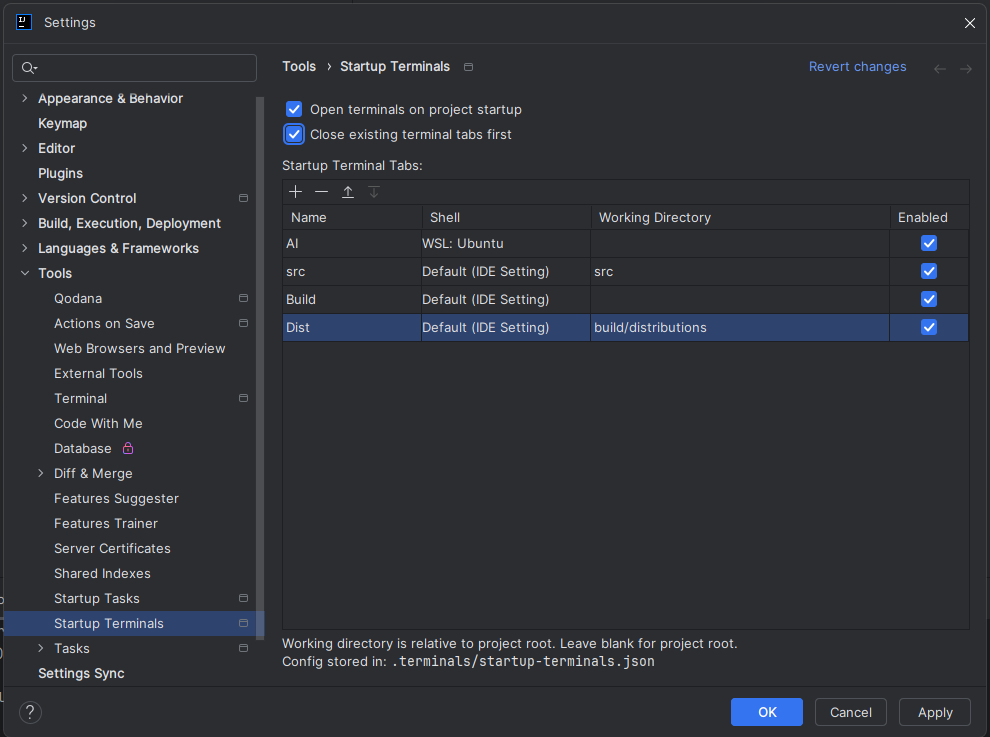
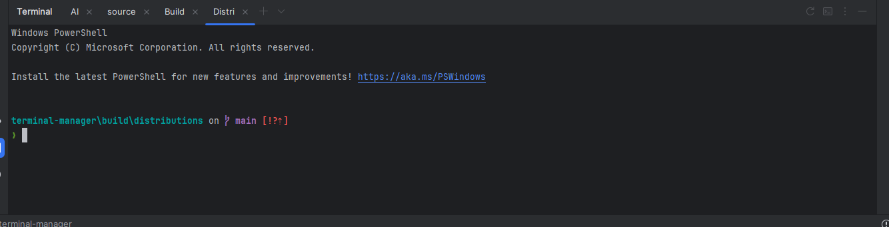

# Terminal Manager

An IntelliJ plugin that automatically opens pre-configured terminal tabs when you open a project.

I created this plugin out of frustration when working with a monorepo where I needed multiple tools running in different terminal windows. Feature requests are welcome - feel free to open an issue on GitHub or raise a PR. 

## Features

- Automatically open multiple terminal tabs on project startup
- Configure different shells per tab (PowerShell, WSL/Ubuntu, CMD, Git Bash, etc.)
- Set custom working directories relative to project root
- Name your terminal tabs for easy identification
- Enable/disable individual tabs without deleting them
- Optionally run a tab inside a persistent **tmux** session (macOS/Linux) so shells and long-running processes survive IDE restarts
- Optionally close existing terminal tabs before opening new ones
- Reset terminals with one click to restore your configured setup
- Set per-tab environment variables
- Open a tab only when a given path exists (conditional "Open If" tabs)
- Open any configured tab on demand from the terminal toolbar
- Per-machine local overrides via a dedicated "Local" scope in settings (tweak, mute, or add personal tabs) with a live effective preview
- Per-project configuration stored in `.terminals/startup-terminals.json`

## Installation

Install from the JetBrains Marketplace:
1. Open **Settings** > **Plugins** > **Marketplace**
2. Search for "Terminal Manager"
3. Click **Install**

## Usage

### Toolbar Buttons

The plugin adds three buttons to the terminal toolbar:



| Button | Icon | Description |
|--------|------|-------------|
| **Open Terminal Tab** | Plus icon | Open any configured tab on demand from a popup list |
| **Reset Terminals** | Restart icon | Close all terminals and reopen configured startup terminals |
| **Settings** | Console icon | Open the Startup Terminals settings |

You can also access settings via **Settings** > **Tools** > **Startup Terminals**

### Open a configured terminal on demand

Your configured terminals also appear in the terminal tool window's **new session dropdown** (the chevron next to the **+** button), listed by name. Selecting one opens that terminal on demand — with its shell, working directory, tmux, startup command and color settings — without waiting for the next project startup.

### Configuring Terminal Tabs



| Option | Description |
|--------|-------------|
| **Open terminals on project startup** | Enable/disable automatic terminal opening |
| **Close existing terminal tabs first** | Clear existing tabs before opening configured ones |

### Tab Configuration

| Column | Description |
|--------|-------------|
| **Name** | Display name for the terminal tab |
| **Shell** | Shell type (Default, PowerShell, WSL, CMD, Git Bash, etc.) |
| **Working Directory** | Path relative to project root (leave blank for project root) |
| **Startup Command** | Command typed into the terminal after it initializes (requires enabling startup commands for the project) |
| **Color** | Optional tab color for quick visual identification |
| **Enable tmux** | (macOS/Linux only) Run the tab inside a tmux session named after the tab. The session reattaches on the next project open, so long-running processes survive IDE restarts. When reattaching to an existing session, the startup command is skipped so it isn't run twice. Mouse mode is enabled for the session so the mouse wheel scrolls the tmux scrollback buffer. Greyed out on Windows. |
| **Enabled** | Toggle individual tabs on/off |

Use the **+** / **-** buttons to add or remove tabs, and the arrow buttons to reorder them.

tmux settings live in **Settings** > **Tools** > **Terminal Manager** (per-machine, not in the shared project config):

- **tmux binary** — path to the tmux binary used by tmux-enabled tabs. Defaults to `tmux` (resolved via `PATH`); set an absolute path if tmux is installed elsewhere. The field shows the detected tmux version in green, or a red "tmux not found" if it can't be resolved.
- **tmux command** — the tmux command template (arguments after the binary). Placeholders: `{name}` = session name, `{dir}` = working directory, `{command}` = the shell command run on session creation (startup command + shell; inserted as one argument, omitted if empty). Defaults to the command the plugin normally uses; use **Reset to default** to restore it.

If a tmux tab can't start — the binary is missing/not really tmux, or the command template is rejected by tmux (e.g. a typo) so no terminal attaches — the plugin shows a notification pointing you back to these settings rather than failing silently.

#### tmux — how it works and known limitations

A tmux tab launches `tmux new-session -A ...` as the tab's shell instead of your shell directly. tmux is a terminal multiplexer that owns the shell process and its screen, so the IDE terminal becomes a passthrough to tmux. This is what gives you **session persistence** (your shells survive closing the tab or the whole IDE and reattach on reopen), but it also means tmux — not the IDE — controls the screen while attached. Consequences to be aware of:

- **Mouse wheel:** the plugin forces tmux `mouse on` so the wheel scrolls tmux's scrollback. This is deliberate — with mouse off, the IDE terminal's "alternate scroll" turns the wheel into command-history navigation. See [IJPL-103757](https://youtrack.jetbrains.com/issue/IJPL-103757).
- **Keybindings:** some tmux keybindings (the `Ctrl-b` prefix, copy-mode keys) may be intercepted by the IDE before reaching tmux. If a tmux shortcut doesn't work, enable the terminal's **Override IDE Shortcuts** toggle. See [IJPL-106405](https://youtrack.jetbrains.com/issue/IJPL-106405).
- **IDE shell features:** command completion, command blocks, and other IDE shell-integration features do **not** work inside a tmux tab (the IDE can't see the shell through tmux). Shell-native completion still works. Use plain (non-tmux) tabs where you want the full IDE terminal experience, and tmux tabs where persistence matters.
- **Stray `^[[?6c` on startup:** occasionally, starting or attaching a tmux tab prints a short escape sequence such as `^[[?6c` (or just `6c`) into the pane. This is a terminal *Device Attributes* response that leaks because of how the IDE terminal and tmux exchange startup queries — it's cosmetic and harmless (press Enter to clear it). Tracked upstream in [IJPL-244366](https://youtrack.jetbrains.com/issue/IJPL-244366/running-tmux-from-terminal-breaks-tmux); the plugin already avoids one cause by never attaching the same session twice.

Because of these inherent IDE↔tmux interactions, the mouse workaround is intentional and should not be removed.

### Result

Once configured, your terminal tabs will automatically open when you open the project:



### Reset Terminals

Click the reset button to close all current terminal tabs and reopen your configured startup terminals. A confirmation dialog will appear the first time - check "Don't ask again" to skip this dialog in the future.

## Configuration File

Settings are stored per-project in `.terminals/startup-terminals.json`. You can commit this file to share terminal configurations with your team.

Example configuration:
```json
{
  "enabled": true,
  "closeExistingTerminals": true,
  "skipResetConfirmation": false,
  "tabs": [
    {
      "id": "a1b2c3d4-...",
      "name": "AI",
      "shellId": "wsl-ubuntu",
      "workingDirectory": "",
      "enabled": true,
      "env": { "NODE_ENV": "development" },
      "openIf": ""
    },
    {
      "id": "e5f6g7h8-...",
      "name": "Docker",
      "shellId": "default",
      "workingDirectory": "",
      "enabled": true,
      "openIf": "docker-compose.yml",
      "useTmux": true
    }
  ]
}
```

Each tab is assigned a stable `id` automatically. `env` injects environment variables when the tab opens (requires project trust, like startup commands). `openIf` is a project-root-relative path — the tab opens only if that file or directory exists (blank = always).

### Local Overrides (per-machine)

Open **Settings > Tools > Startup Terminals** and switch the scope toggle to **Local (this machine)** to:

- **Override** a shared tab for this machine only — pick the shared tab from the dropdown and change only the fields you want (shell, working directory, env, etc.).
- **Mute** a shared tab you don't use locally.
- **Add a personal tab** that isn't shared with the team.

The **Effective (what will run)** preview shows the merged result and where each tab comes from (Shared / Overridden / Personal). Local overrides are written to `.terminals/startup-terminals.local.json`; the settings screen offers to add this file to `.gitignore` so it stays off the shared config. You no longer need to edit this file by hand.
